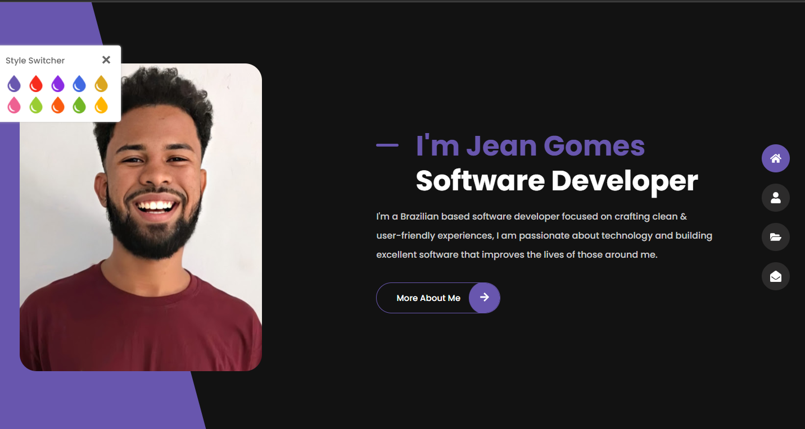
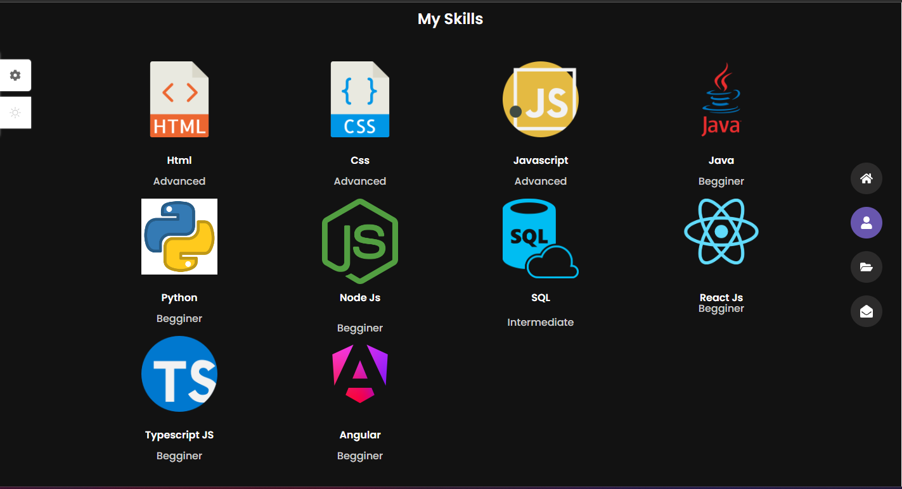
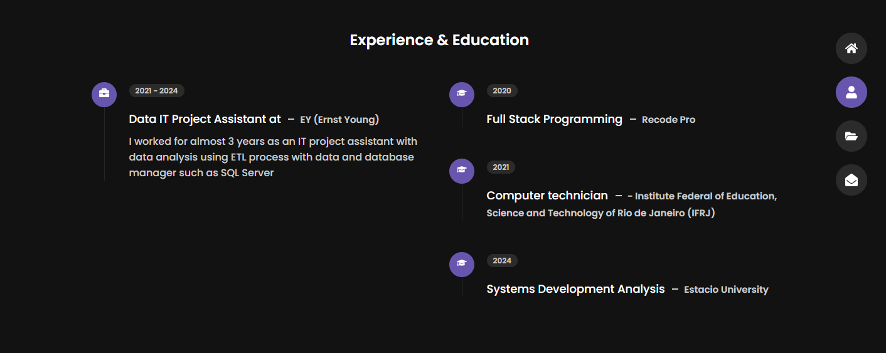
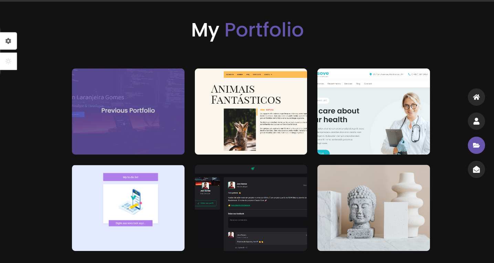
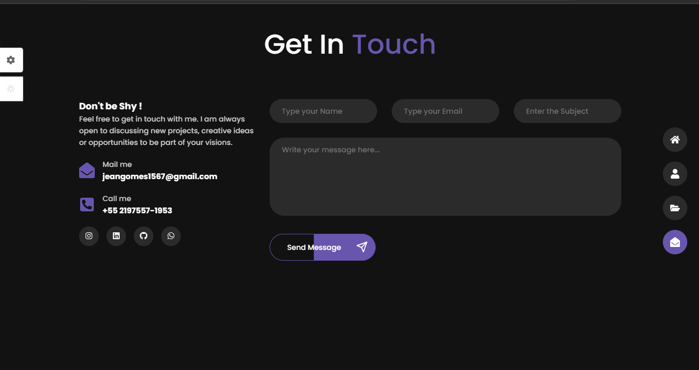

<h1 align="center">Projeto - React JS  : Portfolio</h1>

<p align="center">
  

  

  
  
  <a href="https://github.com/JeanGomes01/Github-Blog/commits/master">
    
  </a>
    
   <a href="https://github.com/JeanGomes01/PortfolioCurrent/stargazers">
    
  </a>
</p>

<p align="center">Portfólio desenvolvido em React apresentando projetos pessoais e profissionais, com design responsivo e navegação intuitiva. Inclui seções para habilidades, experiência, projetos destacados e informações de contato, proporcionando uma visão clara e organizada das minhas competências e realizações. </p>

<p align="center">

</p>

## 🥶 Sobre o projeto

Desenvolvi esse projeto para reforçar meu conhecimento em React JS, apresentar minhas principais competências com funcionalidades de mudança de cores no layout e mudança no tema para Light Mode e Dark Mode, redirecionamento de para outros projetos. Utiliza react-router-dom para gerenciamento de rotas, permitindo uma navegação mais fluida, formulário de contato funcional utilizando serviço do EmailJS para enviar e-mails diretamente de aplicativos JavaScript sem a necessidade de um servidor backend. Variáveis CSS e hooks para gestão de estado tornando os componentes funcionais, garantindo uma interface dinâmica e responsiva.

## 🚀 Tecnologias

Principais tecnologias que utilizei para desenvolver esta aplicação

- [React](https://pt-br.legacy.reactjs.org/)
- [React-Router-DOM](https://reactrouter.com/en/main)
- [EmailJS](https://www.emailjs.com/docs/sdk/installation/)

- [@vitejs/plugin-react](https://github.com/vitejs/vite-plugin-react/blob/main/packages/plugin-react/README.md) uses [Babel](https://babeljs.io/) for Fast Refresh
- [@vitejs/plugin-react-swc](https://github.com/vitejs/vite-plugin-react-swc) uses [SWC](https://swc.rs/) for Fast Refresh

## Guia de inicialização

Para instalar e configurar uma cópia local, siga estas etapas simples:

### Pré-requisitos

Para garantir o funcionamento adequado da nossa aplicação, verifique abaixo:

1. **Clone o repositório de terceiros que contém a api pronta para poder testar o app**: Neste link: [My Portfolio](https://github.com/JeanGomes01/PortfolioCurrent)

2. **Clone o repositório**:

```sh
git clone https://github.com/JeanGomes01/PortfolioCurrent
```

3. **Navegue na raiz do projeto PortfolioCurrent:**

4. **Instale os módulos:**

```sh
npm i
```

5. **Rode o aplicativo:**

```sh
npm run dev
```

## Roadmap

- [x] Iniciar a aplicação Web

- [x] Conseguir trocar de estilo de cores.

- [x] Ser redirecionado para sites de outros projetos

- [x] Conseguir baixar Curriculum Vitae (CV)

- [x] Conseguir encaminhar e-mail na página de contatos.

<!-- --------------------- -->

## UI UX

UI e UX feita pelo time de design do treinamento do curso.

|              Tela inicial               |                 Tela sobre                 |
| :-------------------------------------: | :----------------------------------------: |
|  |  |

|             Tela de habilidades              |                     Tela de Experiência e Formação                      |
| :------------------------------------------: | :---------------------------------------------------------------------: |
|  |  |

|                  Tela inicial                   |                 Tela sobre                  |
| :---------------------------------------------: | :-----------------------------------------: |
|  |  |
